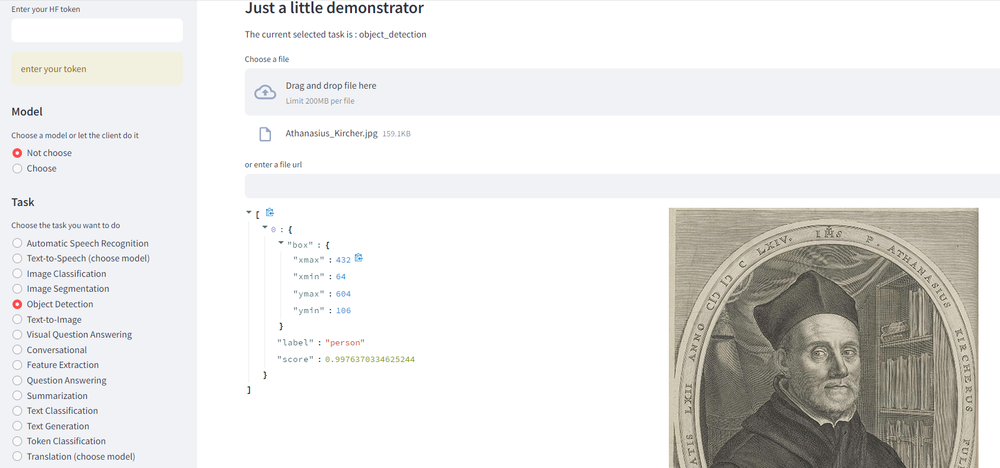

#  HuggingFace Inference Client Demo

> Post : 

> Deployed : https://huggingface.co/spaces/Geraldine/hf_inference_client_demo

A simple demonstrator to illustrate how to use the huggingFace inference client for different tasks with different models

```
git clone
pip install -r requirements.txt
streamlit run app.py
```

Running on http://localhost:8501



