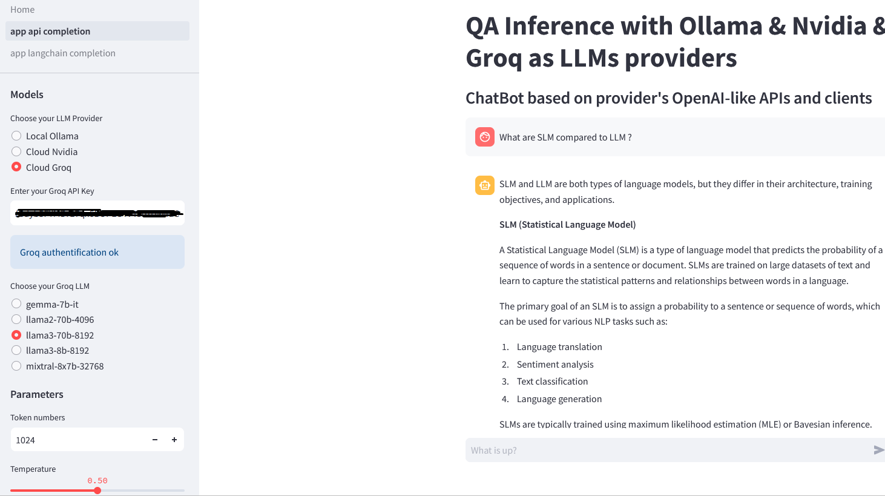

#  Streamlit simple QA Inference App with Ollama, Nvidia Cloud and Groq

> Post : [https://iaetbibliotheques.fr/2024/05/comment-executer-localement-un-llm-22](https://iaetbibliotheques.fr/2024/05/comment-executer-localement-un-llm-22)

> Deployed : [https://huggingface.co/spaces/Geraldine/qa_inference_with_ollama_nvidia_or_groq](https://huggingface.co/spaces/Geraldine/qa_inference_with_ollama_nvidia_or_groq)

Two different ways to develop the same chatbot application
- app_api_completion.py : make QA inference with LLMs by choosing between the native Chat API completion endpoints provided by Ollama, Nvidia or Groq
- app_langchain_completion.py : make QA inference with LLMs with the dedicated Langchain wrappers for Ollama, Nvidia or Groq

You can use one, two or the three LLMs hosting solutions according to your environment :

- a running Ollama instance : the default base_url is http://localhost:11434 but if needed (remote or dockerized Ollama instance for example) you change it in the OllamaClient in clients.py
*and/or*
- a valid API key on the Nvidia Cloud : [https://build.nvidia.com/explore/discover](https://build.nvidia.com/explore/discover)
*and/or*
- a valid API key on Groq Cloud : [https://console.groq.com/playground](https://console.groq.com/playground)


```
git clone
pip install -r requirements.txt
streamlit run Home.py
```

Running on http://localhost:8501



