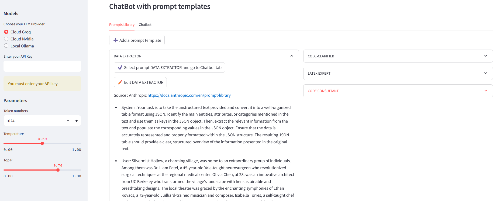

#  Prompts library

> Post : [https://iaetbibliotheques.fr/2024/05/techniques-de-prompts](https://iaetbibliotheques.fr/2024/05/techniques-de-prompts)

> Deployed : [https://huggingface.co/spaces/Geraldine/prompts_library](https://huggingface.co/spaces/Geraldine/prompts_library)

A  streamlit application that allows you to create, store and save custom prompts in a library (in real a simple Json file) and test them directly in a chatbot-like interface.

You can use one, two or the three LLMs hosting solutions according to your environment :

- a running Ollama instance : the default base_url is http://localhost:11434 but if needed (remote or dockerized Ollama instance for example) you change it in the OllamaClient in clients.py
*and/or*
- a valid API key on the Nvidia Cloud : [https://build.nvidia.com/explore/discover](https://build.nvidia.com/explore/discover)
*and/or*
- a valid API key on Groq Cloud : [https://console.groq.com/playground](https://console.groq.com/playground)


```
git clone
pip install -r requirements.txt
streamlit run Home.py
```

Running on http://localhost:8501



