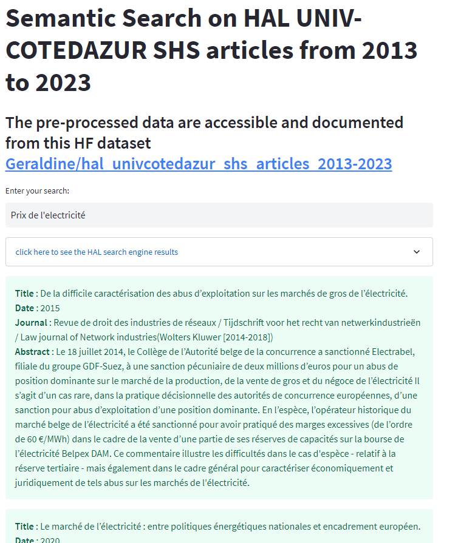

#  Semantic Search on HAL publications (UNIV-COTEDAZUR portal) 

> Post : [https://iaetbibliotheques.fr/2024/06/moteur-de-recherche-semantique-et-cartographie-semantique-de-collections](https://iaetbibliotheques.fr/2024/06/moteur-de-recherche-semantique-et-cartographie-semantique-de-collections)

> Deployed : [https://huggingface.co/spaces/Geraldine/HAL-UNIV-COTEDAZUR_semantic_search](https://huggingface.co/spaces/Geraldine/HAL-UNIV-COTEDAZUR_semantic_search)

A  streamlit application that performs a semantic search on embeddings created from a dataset of publication metadata.

See [https://huggingface.co/datasets/Geraldine/hal_univcotedazur_shs_articles_2013-2023/blob/main/README.md](https://huggingface.co/datasets/Geraldine/hal_univcotedazur_shs_articles_2013-2023/blob/main/README.md) for the dataset extraction and embeddings creation.

The embeddings model is sentence-transformers/all-MiniLM-L6-v2.

```
git clone
pip install -r requirements.txt
streamlit run app.py
```

Running on http://localhost:8501



