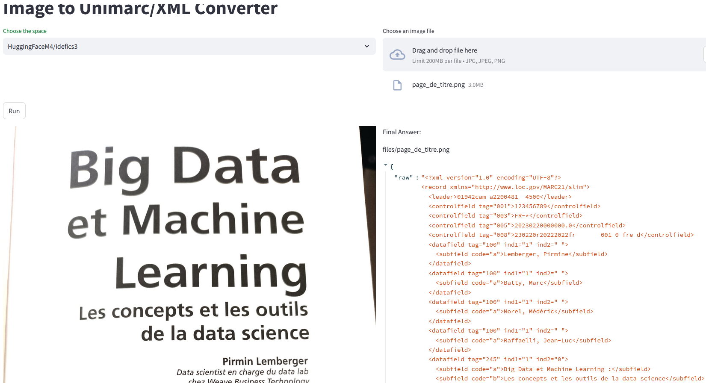

#  Streamlit prototype : Image to Marc record with LLM & VLM

> Post : [https://iaetbibliotheques.fr/2024/10/extraction-de-donnees-structurees-avec-des-llms)

> Deployed : no

## How it works

The app uses the crew.ai framework to orchestrate two agents : 
- the first agent is in charge of extracting textual content from a image with book metadata (could be book cover, screenshot of book record on Electre or even Amazon...) : to make it quick and easy, we use the Gradio API 
with the [Gradio Python client](https://www.gradio.app/guides/getting-started-with-the-python-client) that allows to use Gradio HuggingFace spaces app from an API.
**This is why this app cannot be deployed in production** : for real usage, implement a VLM inference task.
- the second agent is in charge of converting the markdown result provided by the first agent in a Marc/XML record. The LLM provider is Groq and the LLM is llama3-70b-8192.

## Install 

- Put your Groq API key and your HuggingFace token in .streamlit/secrets.toml file
- Run locally
```
git clone
pip install -r requirements.txt
streamlit run app.py.py
```
- Run with Docker
```
git clone
docker build -t image2marc:latest .
docker run -d --name image2marc -p 8501:8501 -v -v $(pwd):/app image2marc:latest
```

The app is running on http://localhost:8501



