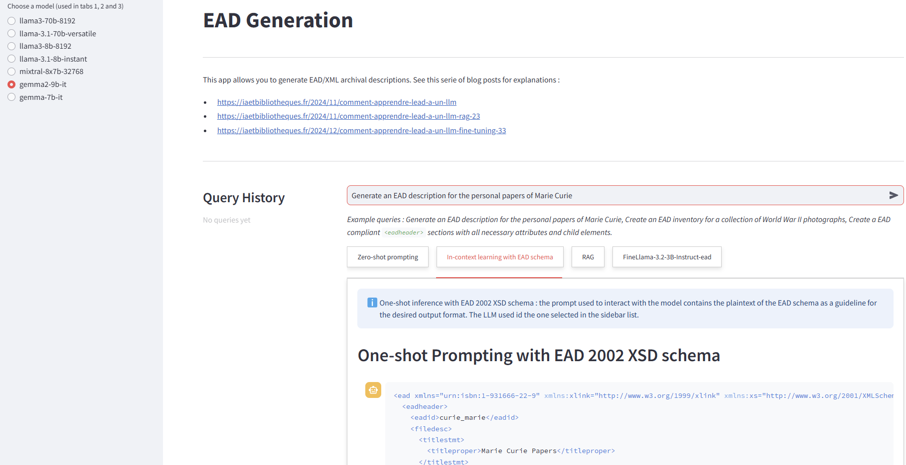

# EAD Generation App

> Post : [https://iaetbibliotheques.fr/2024/11/comment-apprendre-lead-a-un-llm](https://iaetbibliotheques.fr/2024/11/comment-apprendre-lead-a-un-llm)

> Deployed : [https://huggingface.co/spaces/Geraldine/comparative-ead-generation](https://huggingface.co/spaces/Geraldine/comparative-ead-generation)



## Overview

The EAD Generation App is a Streamlit application designed to generate Encoded Archival Description (EAD) and XML archival descriptions. It leverages various language models to provide users with intelligent responses based on their queries related to archival descriptions.

## Features

- **Zero-shot Prompting**: Generate responses without prior examples.
- **One-shot Prompting**: Utilize EAD 2002 XSD schema for generating compliant XML content.
- **Retrieval-Augmented Generation (RAG)**: Enhance responses with relevant context from archival collections.
- **Fine-tuned Model**: Use a custom fine-tuned model for improved accuracy in generating EAD descriptions.

## Requirements

To run this application, you need the following:

- Python 3.7 or higher
- Streamlit
- Langchain
- Transformers
- NumPy
- Joblib

You can install the required packages using pip:

```bash
pip install streamlit langchain transformers numpy joblib
```

## Configuration

Before running the application, you need to set up your API keys. Complete the file named `.streamlit/secrets.toml` in the root directory of the project with your API keys as follows:

```toml
GROQ_API_KEY = "your_groq_api_key"
HF_TOKEN = "your_huggingface_token"
```

Replace `"your_groq_api_key"` and `"your_huggingface_token"` with your actual API keys.

## Running the Application

To start the application, navigate to the project directory in your terminal and run:

```bash
streamlit run app.py
```

This will launch the application in your default web browser.

## Usage

1. Enter your query in the input box.
2. Select the desired model from the sidebar.
3. Explore the different tabs for various prompting methods.
4. View the generated responses in real-time.
