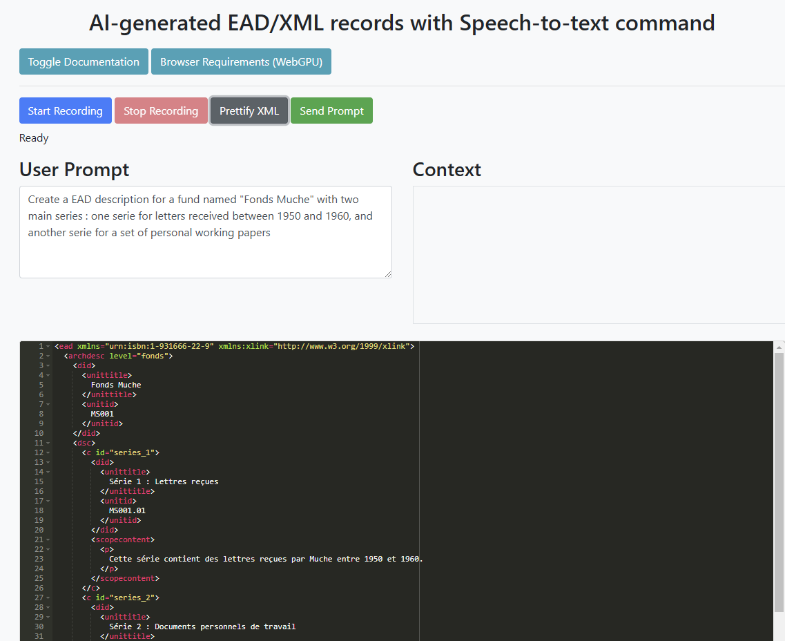

# AI-generated EAD/XML records with Speech-to-text command

> Post : [https://iaetbibliotheques.fr/2024/11/comment-apprendre-lead-a-un-llm)

> Deployed : [https://huggingface.co/spaces/Geraldine/speech-to-text-ead-editor]



## Overview

The EAD/XML Editor is a web application that allows users to generate EAD/XML records using voice commands. It leverages advanced speech recognition technology and natural language processing models to facilitate the creation of archival descriptions. Users can record their instructions, highlight existing XML content to add context, and send the combined prompt to the Ollama model for processing.

## Features

- **Voice Command Input**: Users can record their voice instructions to generate EAD/XML records.

- **Contextual Highlighting**: Users can highlight existing XML content and add it to their prompt for better context.

- **XML Prettification**: The application includes a feature to format XML content for better readability.

- **Collapsible Documentation**: Users can access documentation and browser requirements for using the application effectively.

- **WebGPU Support**: The application utilizes WebGPU for efficient processing of audio transcription and model inference.

## Technologies Used

- **Whisper-small Model**: Utilizes the [Xenova/whisper-small](https://huggingface.co/Xenova/whisper-small) model for audio transcription, implemented using [transformers.js](https://huggingface.co/docs/transformers.js/index) and leveraging WebGPU in the browser.

- **Ollama Model**: Uses the fine-tuned model [hf.co/Geraldine/FineLlama-3.2-3B-Instruct-ead-GGUF:Q5_K_M](https://huggingface.co/Geraldine/FineLlama-3.2-3B-Instruct-ead-GGUF) for generating EAD/XML records based on user instructions and context.

## Getting Started

### Prerequisites

- A modern web browser that supports WebGPU (e.g., Google Chrome, Mozilla Firefox, Microsoft Edge).

- Ensure that WebGPU is enabled in your browser settings.

### Installation

1. Clone the repository:
```
git clone https://github.com/yourusername/ead-xml-editor.git
cd ead-xml-editor
```

2. Open `index.html` in your preferred web browser.

### Usage

1. Click the "Start Recording" button to begin capturing your voice instructions.

2. Highlight any existing XML content and click "Add to Context" to include it in your prompt.

3. Use the "Prettify XML" button to format your XML content.

4. Click "Send Prompt" to generate the EAD/XML based on your instructions.

### Documentation

- Click the "Toggle Documentation" button to view instructions on how to use the application.

- Click the "Browser Requirements" button to check the necessary browser settings for WebGPU support.