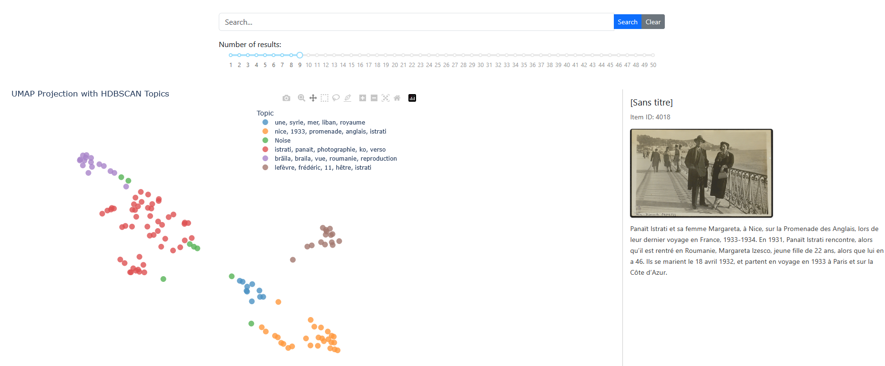

# Omeka S Atlas Visualization App

An interactive visualization tool that creates semantic maps of Omeka S collections using UMAP projection and topic clustering. Built with Dash, Plotly, and powered by Nomic AI embeddings.

> Post : [https://iaetbibliotheques.fr/2025/04/vision-multimodale-et-recherche-semantique-dans-omeka-s](https://iaetbibliotheques.fr/2025/04/vision-multimodale-et-recherche-semantique-dans-omeka-s)

> Deployed : [https://huggingface.co/spaces/Geraldine/omeka-s-computer-vision](https://huggingface.co/spaces/Geraldine/omeka-s-computer-vision)



## Features

- **Data Loading**
  - Direct integration with Omeka S API
  - Local storage using LanceDB for faster subsequent access
  - Support for batch processing of items and media

- **Visualization**
  - Interactive UMAP projection of collection items
  - Automatic topic clustering with HDBSCAN
  - Dynamic topic labeling using TF-IDF
  - Zoom-based hierarchical topic exploration

- **Search & Exploration**
  - Semantic search using both text and image content
  - Interactive hover details with image previews
  - Adjustable number of search results
  - Pan and zoom navigation

## Installation

1. Clone the repository:
```bash
git clone https://github.com/yourusername/omeka-s-computer-vision.git
cd omeka-s-atlas-app
```

2. Create and activate a virtual environment:
```bash
python -m venv venv
.\venv\Scripts\activate
```

3. Install dependencies:
```bash
pip install -r requirements.txt
```

4. Create a `.env` file with your credentials:
```env
HF_TOKEN=your_huggingface_token
_DEFAULT_PARSE_METADATA=dcterms:identifier,dcterms:type,dcterms:title,dcterms:description,...
```

## Usage

1. Start the application:
```bash
python app.py
```

2. Access the web interface at `http://localhost:8050`

3. Load data either:
   - From Omeka S: Enter your instance URL and select a collection
   - From LanceDB: Load previously processed collections

4. Explore the visualization:
   - Hover over points to see item details
   - Use the search bar for semantic queries
   - Adjust search results with the slider
   - Pan and zoom to explore topic hierarchies

## Technologies

- **Frontend**: Dash, Plotly, Bootstrap
- **Backend**: Python, LanceDB
- **ML/AI**: 
  - Nomic AI Embeddings (Text & Vision)
  - UMAP for dimensionality reduction
  - HDBSCAN for clustering

## Requirements

- Python 3.8+
- Hugging Face account with API token
- Access to an Omeka S instance
- Sufficient storage for LanceDB